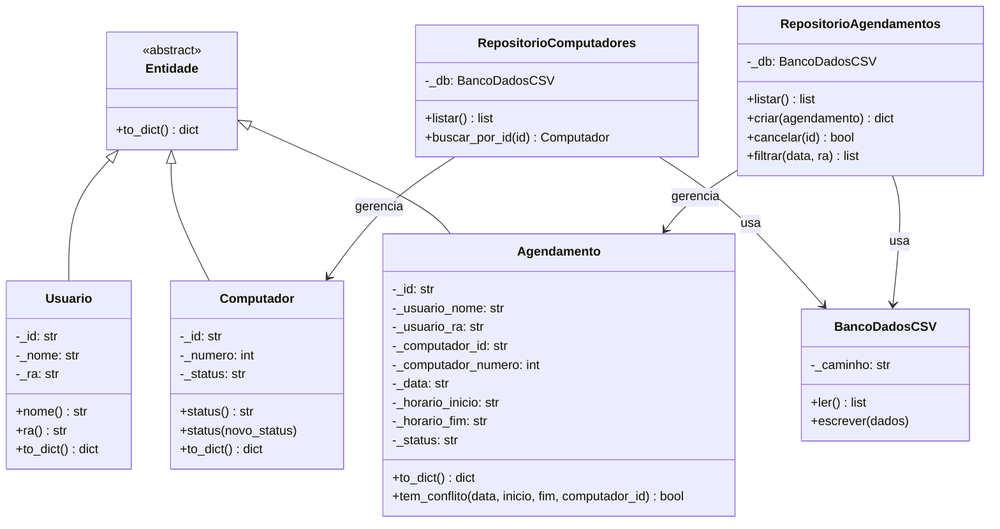

# UNIFIEO — Sistema de Agendamento de Computadores
Sistema web de agendamento de computadores para o laboratório da faculdade UNIFIEO, inspirado na plataforma **DeskBee**. Desenvolvido em **Python (Flask)** com boas práticas de **Programação Orientada a Objetos (POO)** e banco de dados em **CSV**.

## Tecnologias Utilizadas

### **Backend**


### **Frontend**


### **Ferramentas**


**Dependências do Projeto:**  
```bash
# Apenas Flask é necessário
pip install flask
```

## Como Executar

### 1. Pré-requisitos

- Python (v3.8+)
- pip (gerenciador de pacotes Python)

```bash
# Clonar repositório
git clone https://github.com/seu-usuario/unifieo-agendamento
cd unifieo-agendamento
```

### 2. Configuração Inicial

1. **Instalar dependências:**
```bash
pip install flask
```

> **Nota:** O projeto não requer arquivo `.env` pois usa CSV como banco de dados. Os arquivos CSV são criados automaticamente na pasta `data/` na primeira execução.

2. **Iniciar Servidor:**
```bash
# Backend (raíz do projeto)
python app.py
```

3. **Acessar a aplicação:**
```
http://localhost:5000
```

## Estrutura de Pastas

```bash
📦 unifieo-agendamento
├── 📄 app.py                    # Aplicação principal Flask (rotas e API REST)
├── 📄 models.py                 # Modelos POO (entidades, repositórios, DAO)
├── 📂 data/                     # Banco de dados CSV (gerado automaticamente)
│   ├── 📄 computadores.csv      # Dados dos computadores da sala
│   └── 📄 agendamentos.csv      # Dados dos agendamentos
├── 📂 templates/
│   └── 📄 index.html            # Página HTML principal (SPA)
├── 📂 static/
│   ├── 📂 css/
│   │   └── 📄 style.css         # Estilos do sistema (design DeskBee-inspired)
│   └── 📂 js/
│       └── 📄 app.js            # Lógica JavaScript do frontend
└── 📄 README.md                 # Documentação do projeto
```

## Diagrama de Classes (UML)



### Principais Características da Estrutura:

1. **Organização por Camadas (MVC):**
```bash
app.py          # Controller (rotas e lógica de controle)
models.py       # Model (entidades e acesso a dados)
templates/      # View (interface HTML)
static/         # Assets (CSS, JS)
```

2. **Padrões de Projeto Aplicados:**
```bash
DAO Pattern     # Repositórios isolam acesso aos dados
POO             # Encapsulamento, Herança, Abstração, Polimorfismo
API REST        # Endpoints padronizados
SPA             # Navegação sem reload de página
```

3. **Banco de Dados Simples:**
```bash
data/           # Persistência em CSV (sem necessidade de SGBD)
```

## Funcionalidades

### Dashboard Interativo
- Visão geral com cards de estatísticas do sistema
- Tabela de agendamentos recentes em tempo real
- Indicadores de computadores disponíveis e ocupados

### Sistema de Agendamento
- Formulário completo com validação de campos
- Seleção de computador, data e horário
- Verificação automática de conflitos de horários
- Geração de ID único (UUID) para cada agendamento

### Gestão de Agendamentos
- Busca de agendamentos por RA do aluno
- Cancelamento de agendamentos ativos
- Filtros por data e usuário
- Status de agendamento (ativo, cancelado, concluído)

### Mapa Visual da Sala
- Grid interativo com os 20 computadores
- Indicadores visuais de status em tempo real:
  - 🟢 Verde: Disponível
  - 🟡 Amarelo: Ocupado
  - 🔴 Vermelho: Em manutenção
- Atualização dinâmica do mapa

### Sistema de Notificações
- Toasts de sucesso para ações bem-sucedidas
- Alertas de erro para problemas e conflitos
- Feedback visual imediato para o usuário


## Conceitos de POO Aplicados

| Conceito           | Onde é aplicado                                                |
|--------------------|----------------------------------------------------------------|
| **Encapsulamento** | Atributos privados (`_nome`, `_ra`) com `@property` getters   |
| **Abstração**      | Classe abstrata `Entidade` com `ABC` e `@abstractmethod`      |
| **Herança**        | `Usuario`, `Computador` e `Agendamento` herdam de `Entidade`  |
| **Polimorfismo**   | Método `to_dict()` implementado de forma diferente por classe  |
| **Composição**     | Repositórios usam `BancoDadosCSV` internamente                |
| **DAO Pattern**    | `RepositorioComputadores` e `RepositorioAgendamentos`         |

### Exemplos de Código

**Encapsulamento com Properties:**
```python
class Computador(Entidade):
    def __init__(self, id: str, numero: int, status: str):
        self._id = id
        self._numero = numero
        self._status = status
    
    @property
    def status(self):
        return self._status
    
    @status.setter
    def status(self, novo_status: str):
        if novo_status in ("disponivel", "manutencao"):
            self._status = novo_status
```

**Herança e Abstração:**
```python
class Entidade(ABC):
    @abstractmethod
    def to_dict(self) -> dict:
        pass

class Agendamento(Entidade):
    def to_dict(self) -> dict:
        return {
            "id": self._id,
            "usuario_nome": self._usuario_nome,
            # ... demais campos
        }
```

## Rotas da API

| Método | Rota                                  | Descrição                         |
|--------|---------------------------------------|-----------------------------------|
| GET    | `/`                                   | Renderiza a página principal      |
| GET    | `/api/computadores`                   | Lista todos os computadores       |
| GET    | `/api/computadores/<id>`              | Busca computador por ID           |
| GET    | `/api/agendamentos`                   | Lista agendamentos (filtros: `?data=` ou `?ra=`) |
| POST   | `/api/agendamentos`                   | Cria novo agendamento             |
| PUT    | `/api/agendamentos/<id>/cancelar`     | Cancela um agendamento            |
| GET    | `/api/status`                         | Retorna estatísticas do sistema   |

### Exemplos de Uso da API

**Criar Agendamento:**
```json
POST /api/agendamentos
{
    "usuario_nome": "João Silva",
    "usuario_ra": "12345",
    "computador_id": "pc-01",
    "data": "2026-03-25",
    "horario_inicio": "08:00",
    "horario_fim": "10:00"
}
```

**Resposta de Sucesso:**
```json
{
    "sucesso": true,
    "agendamento": {
        "id": "a1b2c3d4",
        "usuario_nome": "João Silva",
        "usuario_ra": "12345",
        "computador_id": "pc-01",
        "computador_numero": "1",
        "data": "2026-03-25",
        "horario_inicio": "08:00",
        "horario_fim": "10:00",
        "status": "ativo"
    }
}
```

**Buscar Agendamentos por Data:**
```bash
GET /api/agendamentos?data=2026-03-25
```

**Buscar Agendamentos por RA:**
```bash
GET /api/agendamentos?ra=12345
```

**Cancelar Agendamento:**
```bash
PUT /api/agendamentos/a1b2c3d4/cancelar
```

## Banco de Dados (CSV)

### Estrutura: `computadores.csv`
```csv
id,numero,descricao,status
pc-01,1,Desktop Dell OptiPlex - Sala 101,disponivel
pc-02,2,Desktop Dell OptiPlex - Sala 101,disponivel
pc-03,3,Desktop Dell OptiPlex - Sala 101,manutencao
...
```

**Campos:**
- `id`: Identificador único (ex: pc-01, pc-02)
- `numero`: Número do computador na sala (1-20)
- `descricao`: Descrição do hardware e localização
- `status`: Estado atual (disponivel | manutencao)

### Estrutura: `agendamentos.csv`
```csv
id,usuario_nome,usuario_ra,computador_id,computador_numero,data,horario_inicio,horario_fim,status
a1b2c3d4,João Silva,12345,pc-01,1,2026-03-25,08:00,10:00,ativo
e5f6g7h8,Maria Santos,67890,pc-05,5,2026-03-25,14:00,16:00,cancelado
```

**Campos:**
- `id`: UUID único do agendamento (8 caracteres)
- `usuario_nome`: Nome completo do aluno
- `usuario_ra`: RA (Registro Acadêmico)
- `computador_id`: ID do computador reservado
- `computador_numero`: Número do PC (referência visual)
- `data`: Data do agendamento (YYYY-MM-DD)
- `horario_inicio`: Hora de início (HH:MM)
- `horario_fim`: Hora de término (HH:MM)
- `status`: Estado (ativo | cancelado | concluido)

> **Nota:** Os arquivos CSV são criados automaticamente na primeira execução. São inicializados 20 computadores padrão.

## Design e Interface

### Paleta de Cores (Dark Theme)
```css
--bg: #0f1117           /* Fundo principal */
--bg-card: #181a20      /* Cards e componentes */
--text: #e4e6ed         /* Texto principal */
--accent: #4f7cf7       /* Cor de destaque (azul) */
--green: #34d399        /* Sucesso / Disponível */
--amber: #fbbf24        /* Atenção / Ocupado */
--red: #f87171          /* Erro / Manutenção */
```

### Tipografia
- **Principal:** DM Sans (clean, moderno)
- **Monospace:** JetBrains Mono (códigos e IDs)
- Fonte importada via Google Fonts

### Componentes Visuais
- **Sidebar:** Navegação fixa com 260px de largura
- **Cards:** Estatísticas com ícones e badges de cor
- **Tabelas:** Listagens responsivas com hover
- **Formulários:** Inputs estilizados com validação
- **Grid de Computadores:** Layout 5x4 para mapa visual
- **Toasts:** Notificações animadas no canto superior direito


## Validações e Regras de Negócio

### Validação de Agendamento
1. **Campos obrigatórios:** nome, RA, computador, data, horário início/fim
2. **Computador válido:** ID deve existir e estar disponível (não em manutenção)
3. **Horários válidos:** 
   - Formato HH:MM
   - Hora final > hora inicial
4. **Conflito de horários:** Verifica sobreposição com agendamentos ativos do mesmo PC
5. **Data mínima:** Não permite agendamento em datas passadas (validação frontend)

### Detecção de Conflitos
```python
def tem_conflito(self, data, horario_inicio, horario_fim, computador_id):
    if self._status != "ativo":
        return False
    if self._data != data or self._computador_id != computador_id:
        return False
    # Verifica sobreposição de horários
    return not (horario_fim <= self._horario_inicio or 
                horario_inicio >= self._horario_fim)
```

### Status de Agendamento
- **ativo:** Agendamento confirmado e vigente
- **cancelado:** Cancelado pelo usuário
- **concluido:** Finalizado após o horário (não implementado na versão atual)

## Contribuição

Contribuições são sempre bem-vindas! Para isso:

1. Faça um fork do projeto  
2. Crie uma branch com sua feature: `git checkout -b minha-feature`  
3. Faça o commit: `git commit -m 'feat: minha nova feature'`  
4. Dê push na branch: `git push origin minha-feature`  
5. Abra um Pull Request

## Informações Acadêmicas

- **Instituição:** Centro Universitário FIEO (UNIFIEO)
- **Disciplina:** Programação Orientada a Objetos
- **Tecnologias:** Python, Flask, HTML5, CSS3, JavaScript, CSV
- **Padrões:** POO, MVC, DAO, API REST, SPA
- **Inspiração:** Plataforma DeskBee

## Contato

- **Desenvolvedor:** Laura Camargo da Silva
- **Email:** lauracamargo2007@gmail.com
- **LinkedIn:** http://linkedin.com/in/lauracammargo/
- **GitHub:** lauracamarggo
